# Cloud Services & Web App Deployment

## 1. Introduction

Cloud computing provides on-demand access to computing resources such as servers, storage, databases, networking, security, and monitoring services over the internet.

Instead of purchasing and maintaining physical infrastructure, organizations can provision cloud resources according to their requirements and scale them when needed.

A typical cloud-based web application combines multiple services:

```text
Application Code
       ↓
Cloud Compute
       ↓
Database / Object Storage
       ↓
Virtual Networking
       ↓
IAM & Security
       ↓
Monitoring & Logging
       ↓
Live Web Application
```

### Objectives

The objectives of this hands-on project is to:

* Understand major cloud services.
* Explore compute resources.
* Understand object storage.
* Work with managed databases.
* Configure virtual networking.
* Understand IAM and access policies.
* Monitor cloud resources and applications.
* Manage environment variables securely.
* Protect secrets and credentials.
* Understand cloud resource quotas.
* Deploy a web application to the cloud.
* Connect an application with databases and storage.
* Understand the complete cloud deployment workflow.

---

# 2. Cloud Service Models

Cloud services are commonly divided into three major service models.

## Infrastructure as a Service — IaaS

IaaS provides fundamental infrastructure such as:

* Virtual machines
* Storage
* Networking
* Firewalls
* IP addresses

The user is responsible for managing the operating system and applications.

**Examples:**

* AWS EC2
* Azure Virtual Machines
* Google Compute Engine

```text
Cloud Provider
├── Hardware
├── Networking
└── Virtualization

User
├── Operating System
├── Runtime
├── Application
└── Data
```

---

## Platform as a Service — PaaS

PaaS provides a managed application platform.

The cloud provider manages much of the underlying infrastructure while developers focus primarily on application code.

Examples include:

* AWS Elastic Beanstalk
* Azure App Service
* Google App Engine

```text
Developer
    ↓
Application Code
    ↓
Managed Platform
    ↓
Cloud Infrastructure
```

---

## Software as a Service — SaaS

SaaS provides complete software applications through the internet.

Examples include:

* Gmail
* Microsoft 365
* Salesforce

The user generally does not manage the underlying infrastructure.

---

# 3. Cloud Compute Services

Compute services provide processing resources required to execute applications and workloads.

Common compute options include:

* Virtual machines
* Containers
* Container orchestration
* Serverless functions
* Managed application platforms

## Virtual Machines

A virtual machine is a software-defined computer running on cloud infrastructure.

A VM can have:

* CPU
* RAM
* Disk storage
* Operating system
* Network interface
* Public or private IP address

Examples:

| Cloud Provider | Compute Service  |
| -------------- | ---------------- |
| AWS            | EC2              |
| Azure          | Virtual Machines |
| Google Cloud   | Compute Engine   |

A VM can be used to host a web server and application.

```text
Internet
   ↓
Cloud VM
   ↓
Web Server
   ↓
Application
```

### Advantages

* High level of control.
* Custom operating system configuration.
* Flexible software installation.
* Suitable for traditional server-based applications.

### Considerations

The user may need to manage:

* OS updates
* Security patches
* Firewall configuration
* Application runtime
* Server monitoring
* Scaling

---

# 4. Containers

Containers package an application together with its dependencies.

```text
Application
     +
Runtime
     +
Dependencies
     ↓
Container
```

Containers provide consistency between development, testing, and production environments.

A common container technology is Docker.

### Benefits

* Portability
* Consistent environments
* Faster deployment
* Application isolation
* Easier scaling

Containers can be deployed using managed container services or orchestration platforms.

---

# 5. Object Storage

Object storage is designed to store unstructured data as objects.

Typical use cases include:

* Images
* Videos
* Documents
* Backups
* Static files
* Application uploads
* Log archives

Examples:

| Cloud Provider | Object Storage     |
| -------------- | ------------------ |
| AWS            | Amazon S3          |
| Azure          | Azure Blob Storage |
| Google Cloud   | Cloud Storage      |

Object storage generally uses a structure similar to:

```text
Bucket
│
├── images/
├── documents/
├── backups/
└── static/
```

Each stored object typically contains:

* Data
* Object name/key
* Metadata

### Example

A web application may allow users to upload profile images.

Instead of storing the image directly on the application server:

```text
User
 ↓
Web Application
 ↓
Object Storage
```

The application stores the file in a cloud storage bucket and stores the corresponding object reference in the database.

---

# 6. Managed Databases

A managed database is a database service operated by the cloud provider.

The provider handles many operational tasks such as:

* Provisioning
* Backups
* Patching
* Maintenance
* Monitoring
* High availability options

Examples:

| Cloud Provider | Managed Database |
| -------------- | ---------------- |
| AWS            | Amazon RDS       |
| Azure          | Azure Database   |
| Google Cloud   | Cloud SQL        |

Common database engines include:

* PostgreSQL
* MySQL
* MariaDB
* Microsoft SQL Server

---

## Application Database Architecture

Instead of installing a database directly on the application server:

```text
Application VM
    |
    └── Local Database
```

a cloud application can use:

```text
Application Server
       |
       ↓
Managed Database
```

This provides better separation between application and database responsibilities.

---

# 7. Virtual Networking

Virtual networking allows cloud resources to communicate with each other securely.

Important networking concepts include:

* Virtual networks
* Subnets
* Route tables
* Internet gateways
* NAT
* Security groups
* Network access control
* Public and private networks

---

## Public and Private Resources

A common architecture separates public-facing resources from backend resources.

```text
                  Internet
                     |
                     ↓
              Public Subnet
                     |
                     ↓
              Web Application
                     |
                     ↓
              Private Subnet
                     |
                     ↓
             Managed Database
```

The application server may need internet access, while the database does not need to be directly accessible from the public internet.

### Benefits

* Reduced attack surface
* Better network isolation
* Controlled communication
* Improved security

---

# 8. Security Groups and Firewall Rules

Security groups or equivalent cloud firewall mechanisms control network traffic.

For a basic web application, common ports include:

| Port | Protocol | Purpose |
| ---: | -------- | ------- |
|   22 | TCP      | SSH     |
|   80 | TCP      | HTTP    |
|  443 | TCP      | HTTPS   |

Only required ports should be exposed.

A database port should normally be restricted to trusted application resources rather than exposed publicly.

---

# 9. IAM — Identity and Access Management

IAM controls access to cloud resources.

IAM answers three important questions:

```text
Who?
 ↓
Can perform what action?
 ↓
On which resource?
```

For example:

```text
Application Role
      ↓
GetObject
      ↓
Specific Storage Bucket
```

IAM can be used to control:

* Users
* Groups
* Roles
* Applications
* Services
* Resources

---

# 10. Principle of Least Privilege

The principle of least privilege means providing only the permissions required to perform a task.

### Poor approach

```text
Allow all actions
Allow all resources
```

### Better approach

```text
Allow:
    GetObject
    PutObject

Resource:
    Specific Storage Bucket
```

Least-privilege access reduces the potential impact of compromised credentials or applications.

---

# 11. Cloud Monitoring

Cloud monitoring provides visibility into infrastructure and applications.

Common metrics include:

* CPU utilization
* Memory utilization
* Disk usage
* Network traffic
* Request count
* Response time
* Error rate
* Database connections

Examples:

| Cloud Provider | Monitoring Service |
| -------------- | ------------------ |
| AWS            | CloudWatch         |
| Azure          | Azure Monitor      |
| Google Cloud   | Cloud Monitoring   |

Monitoring can be represented as:

```text
Cloud Resources
      ↓
Metrics & Logs
      ↓
Monitoring Service
      ↓
Dashboard / Alerts
```

---

# 12. Application Logging

Logging records events generated by applications and infrastructure.

Typical application logs include:

* Incoming requests
* Errors
* Authentication events
* Database failures
* Application events
* Service status

Example:

```text
User Request
     ↓
Web Application
     ↓
Application Log
     ↓
Cloud Monitoring
     ↓
Alert / Dashboard
```

Logs are useful for troubleshooting and understanding application behavior.

---

# 13. Environment Variables

Environment variables store configuration outside the application source code.

Examples:

```text
APP_ENV
APP_PORT
DATABASE_HOST
DATABASE_NAME
DATABASE_USER
DATABASE_PASSWORD
STORAGE_BUCKET
CLOUD_REGION
```

Instead of hardcoding configuration:

```python
database_host = "database.example.com"
```

the application can read it from the environment:

```python
database_host = os.getenv("DATABASE_HOST")
```

### Benefits

* Keeps configuration separate from source code.
* Supports different environments.
* Reduces hardcoded configuration.
* Simplifies deployment.

For example:

```text
Development
DATABASE_HOST=dev-db

Production
DATABASE_HOST=prod-db
```

The same application code can therefore be used in both environments.

---

# 14. Secrets Management

Secrets are sensitive values that should be protected.

Examples include:

* Database passwords
* API keys
* Access tokens
* Private keys
* Cloud credentials

Secrets should not be committed to Git repositories.

### Bad Practice

```python
DATABASE_PASSWORD = "password123"
```

### Better Approach

```text
Application
     ↓
Secrets Manager
     ↓
Secret Value
```

Cloud providers provide dedicated services for secrets management.

Examples:

* AWS Secrets Manager
* AWS Systems Manager Parameter Store
* Azure Key Vault

For local development, a `.env` file may be used, but it should normally be excluded from version control.

---

# 15. `.gitignore` and Secret Protection

A `.gitignore` file prevents selected files from being committed to Git.

Example:

```text
.env
*.pem
*.key
credentials.json
secrets.json
```

A safe repository should contain:

```text
.env.example
```

rather than the actual `.env` file.

Example:

```text
DATABASE_HOST=
DATABASE_NAME=
DATABASE_USER=
DATABASE_PASSWORD=
```

The actual values should be supplied securely in the deployment environment.

---

# 16. Cloud Resource Quotas

Cloud providers impose limits on the number or capacity of resources that can be created.

Examples include:

* Number of virtual machines
* CPU capacity
* Storage capacity
* Public IP addresses
* Database instances
* API requests

Before deployment, it is useful to verify:

```text
Required Resources
       ↓
Available Quota
       ↓
Deployment
```

A deployment can fail if the required resource exceeds the account's available quota.

Quotas also help prevent accidental or uncontrolled resource consumption.

---

# 17. Web Application Deployment

Web application deployment is the process of making an application available to users through a server or managed cloud platform.

A typical deployment flow is:

```text
Developer
    ↓
GitHub Repository
    ↓
Application Code
    ↓
Cloud Compute
    ↓
Application Runtime
    ↓
Database / Object Storage
    ↓
Networking
    ↓
Monitoring
    ↓
Live Web Application
```

---

# 18. Example Cloud Web Application Architecture

The practical project for this module uses a cloud-based web application architecture.

```text
                         Internet
                            |
                            ↓
                      Public IP / DNS
                            |
                            ↓
                     ┌─────────────┐
                     │    Nginx    │
                     │ Reverse     │
                     │ Proxy       │
                     └──────┬──────┘
                            |
                            ↓
                     ┌─────────────┐
                     │ Web App     │
                     │ Cloud VM    │
                     └──────┬──────┘
                            |
                    ┌───────┴────────┐
                    ↓                ↓
             Managed Database   Object Storage
                    |
                    ↓
             Cloud Monitoring
```

### Components

**Nginx**

Acts as a reverse proxy and web server.

**Cloud Compute**

Runs the application.

**Managed Database**

Stores structured application data.

**Object Storage**

Stores files and static assets.

**Virtual Network**

Controls communication between cloud resources.

**IAM**

Controls permissions.

**Monitoring**

Collects metrics and logs.

---

# 19. Application Deployment Stack

The practical application can use the following technologies:

| Component            | Technology        |
| -------------------- | ----------------- |
| Programming Language | Python            |
| Web Framework        | Flask             |
| Database             | PostgreSQL        |
| Web Server           | Nginx             |
| Application Server   | Gunicorn          |
| Cloud Compute        | AWS EC2           |
| Object Storage       | Amazon S3         |
| Managed Database     | Amazon RDS        |
| Networking           | Amazon VPC        |
| Identity             | AWS IAM           |
| Monitoring           | Amazon CloudWatch |
| Source Control       | Git + GitHub      |

This stack demonstrates how multiple cloud services work together as one application platform.

---

# 20. Deployment Workflow

The deployment process can be divided into several stages.

## Step 1 — Develop the Application

The application is created and tested locally.

```text
Python + Flask
       ↓
Local Application
```

---

## Step 2 — Configure the Database

A managed database is provisioned.

```text
Application
     ↓
PostgreSQL
```

Database credentials are supplied through secure configuration rather than hardcoded in the source code.

---

## Step 3 — Configure Object Storage

A storage bucket is created for application files or static assets.

```text
Application
     ↓
Object Storage Bucket
```

---

## Step 4 — Configure Networking

The cloud network is configured using:

* Virtual network
* Subnets
* Route tables
* Security rules
* Internet connectivity

---

## Step 5 — Provision Compute

A cloud VM is created and configured.

The server receives:

* Operating system
* Python runtime
* Application code
* Dependencies
* Gunicorn
* Nginx

---

## Step 6 — Deploy the Application

The application is copied or pulled onto the cloud server.

Example:

```text
GitHub
   ↓
Cloud VM
   ↓
Python Application
   ↓
Gunicorn
   ↓
Nginx
```

---

## Step 7 — Configure Environment Variables

Production configuration is supplied through environment variables.

```text
APP_ENV=production
DATABASE_HOST=...
DATABASE_NAME=...
DATABASE_USER=...
DATABASE_PASSWORD=...
STORAGE_BUCKET=...
```

Sensitive values should be managed securely.

---

## Step 8 — Configure Monitoring

Monitoring is enabled for:

* Compute resources
* Application logs
* CPU usage
* Network activity
* Errors

---

## Step 9 — Test the Application

The application should be tested through:

```text
Browser
   ↓
Public IP / Domain
   ↓
Nginx
   ↓
Application
   ↓
Database / Storage
```

A health endpoint can also be used:

```text
GET /health
```

Expected response:

```json
{
    "status": "healthy"
}
```

---

# 21. Security Best Practices

A cloud application should follow basic security principles.

### 1. Never commit secrets

Do not commit:

```text
.env
passwords
API keys
private keys
cloud credentials
```

### 2. Use least privilege

Grant only the permissions required by each user, role, or application.

### 3. Restrict network access

Expose only the required ports.

### 4. Keep databases private

Where possible, databases should not be directly accessible from the public internet.

### 5. Use HTTPS

Production applications should use HTTPS to encrypt communication between clients and the application.

### 6. Monitor resources

Monitoring and logging should be enabled to identify unusual activity and application failures.

### 7. Keep systems updated

Operating systems, frameworks, dependencies, and server software should be regularly updated.

---

# 22. Cloud Deployment Project

The practical project associated with this module is:

**Cloud Services & Web App Deployment**

The project demonstrates a complete cloud deployment pipeline.

### Project Requirements

| Requirement           | Implementation              |
| --------------------- | --------------------------- |
| Compute               | Cloud VM                    |
| Object Storage        | Cloud storage bucket        |
| Managed Database      | PostgreSQL                  |
| Networking            | Virtual network and subnets |
| IAM                   | Role and access policies    |
| Monitoring            | Cloud monitoring            |
| Environment Variables | Application configuration   |
| Secrets               | Secure secret storage       |
| Logging               | Application and system logs |
| Resource Quotas       | Quota verification          |
| Web Application       | Flask application           |
| Reverse Proxy         | Nginx                       |
| Source Control        | GitHub                      |

---

# 23. Project Repository Structure

```text
cloud-services-web-app-deployment/
│
├── README.md
│
├── app/
│   ├── app.py
│   ├── requirements.txt
│   ├── templates/
│   │   └── index.html
│   └── static/
│       └── style.css
│
├── config/
│   └── .env.example
│
├── database/
│   ├── schema.sql
│   └── seed.sql
│
├── infrastructure/
│   ├── network/
│   ├── compute/
│   ├── storage/
│   └── database/
│
├── deployment/
│   ├── nginx/
│   ├── systemd/
│   └── deploy.sh
│
├── monitoring/
│   ├── logging.md
│   └── monitoring.md
│
├── security/
│   ├── iam-policy.json
│   └── security.md
│
├── docs/
│   ├── architecture.md
│   ├── deployment-guide.md
│   └── troubleshooting.md
│
├── screenshots/
│
└── .gitignore
```

---

# 24. Project Objectives

The practical project aims to demonstrate that a web application can be:

1. Developed locally.
2. Stored in GitHub.
3. Deployed to cloud compute.
4. Connected to a managed database.
5. Connected to object storage.
6. Secured using IAM and networking.
7. Configured using environment variables.
8. Protected using secrets management.
9. Monitored using cloud monitoring.
10. Exposed as a live web application.

---

# 25. Key Concepts Learned

After completing this module, the following concepts should be understood:

### Compute

Cloud compute provides processing resources for running applications.

### Object Storage

Object storage provides scalable storage for files and unstructured data.

### Managed Database

Managed databases reduce the operational work required to maintain database infrastructure.

### Networking

Virtual networking controls how cloud resources communicate.

### IAM

IAM controls identity, authentication, authorization, and resource access.

### Monitoring

Monitoring provides visibility into resource and application health.

### Logging

Logs provide detailed information about application and infrastructure events.

### Environment Variables

Environment variables separate application configuration from source code.

### Secrets Management

Secrets management protects sensitive credentials and configuration.

### Resource Quotas

Quotas define limits on cloud resource usage.

### Deployment

Deployment makes an application available in a target environment such as the cloud.

---

# 26. End-to-End Architecture

The complete concept can be summarized as:

```text
                         DEVELOPER
                             |
                             ↓
                          GitHub
                             |
                             ↓
                     Application Code
                             |
                             ↓
                    ┌─────────────────┐
                    │   Cloud Compute │
                    │      / VM       │
                    └────────┬────────┘
                             |
                 ┌───────────┴───────────┐
                 ↓                       ↓
        ┌─────────────────┐      ┌─────────────────┐
        │ Managed         │      │ Object          │
        │ Database        │      │ Storage         │
        └─────────────────┘      └─────────────────┘
                 |
                 ↓
          Virtual Network
                 |
                 ↓
           IAM / Security
                 |
                 ↓
        Monitoring & Logging
                 |
                 ↓
          Live Web Application
```

---

# 27. Final Summary

Cloud services provide the infrastructure and managed capabilities required to build and operate modern applications.

A complete cloud deployment is not limited to running application code on a server. It involves multiple components working together:

```text
Compute
   +
Database
   +
Object Storage
   +
Networking
   +
IAM
   +
Secrets
   +
Environment Configuration
   +
Monitoring
   +
Logging
   ↓
Reliable Cloud Application
```

The practical project demonstrates this complete workflow by deploying a web application to cloud infrastructure and connecting it with managed storage and database services.

The key objective is to understand **how individual cloud services combine to form a secure, manageable, and production-oriented web application architecture**.

-----

# Deployment Evidence

## Application [Live preview]

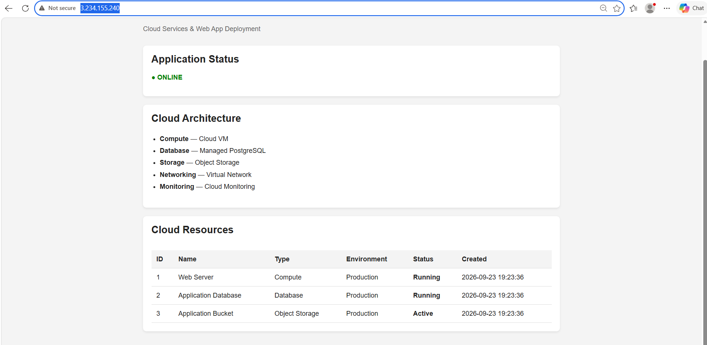

## API Endpoints

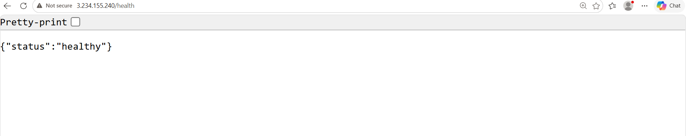
[Application health check]

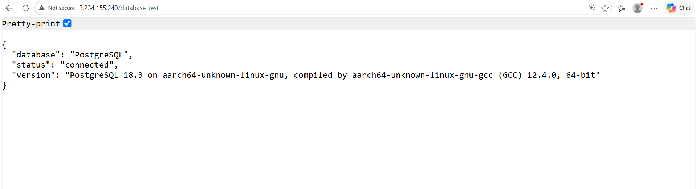
[RDS database connectivity test]

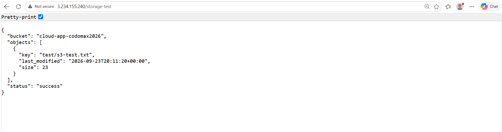
[Tests S3 connectivity]

---

## AWS Infrastructure

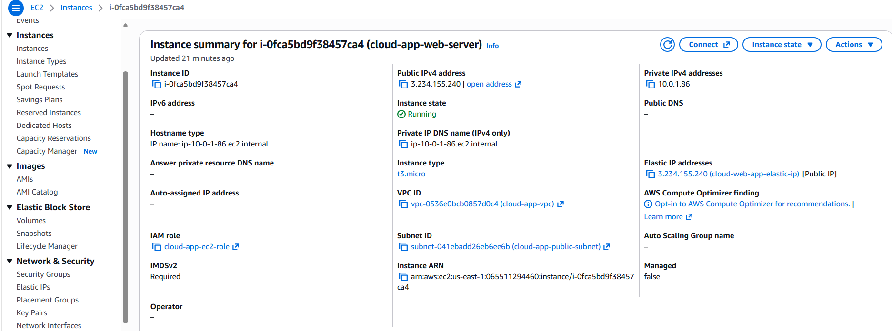
[EC2]

---

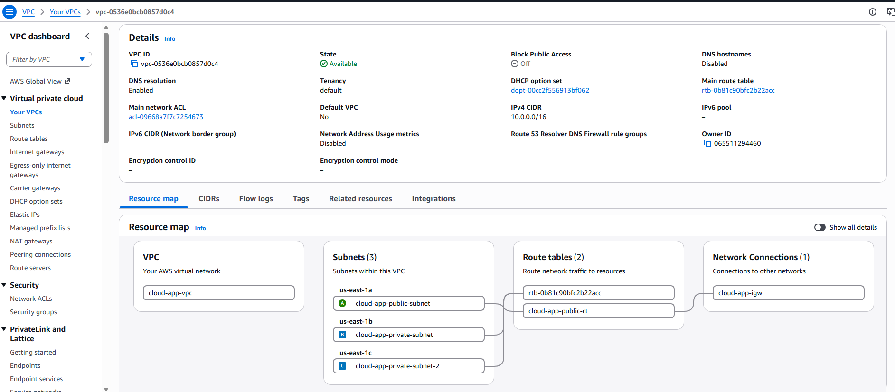
[VPC]

---
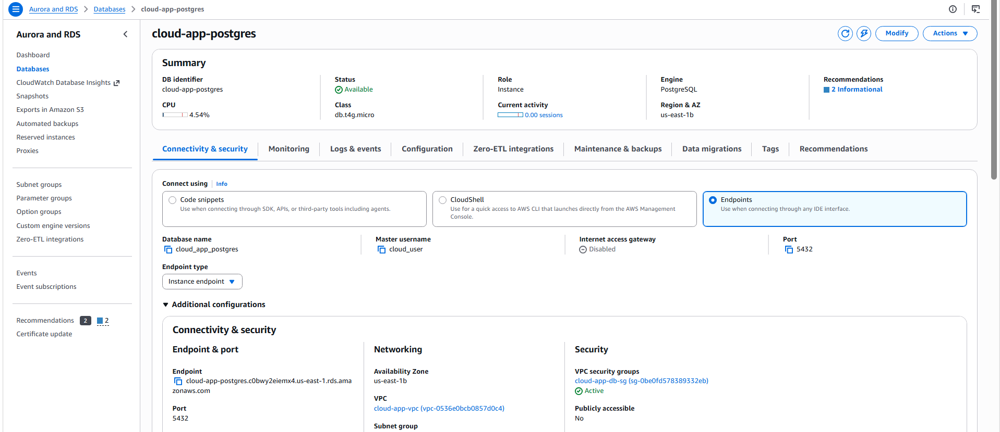
[RDS]

---
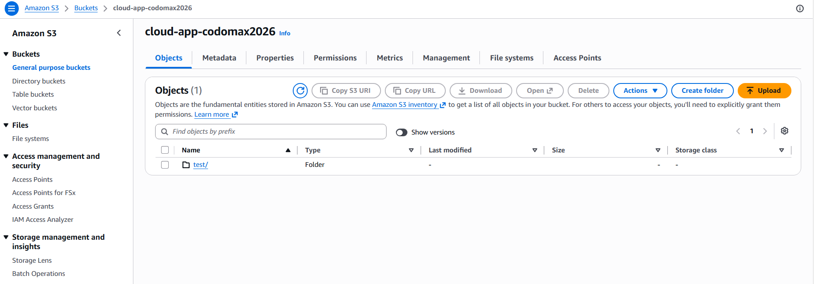

---

## Security

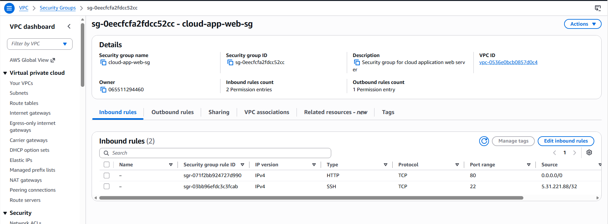
[Web-app Security Group]

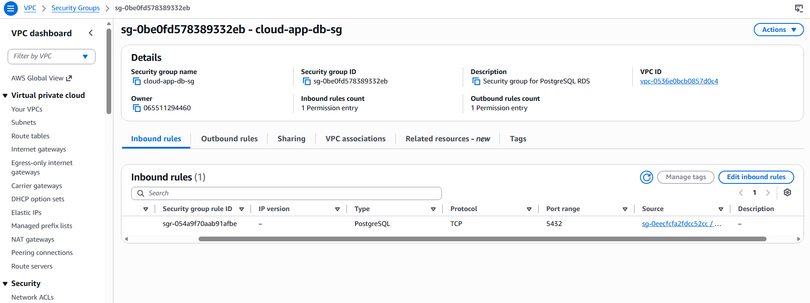
[RDS-DB Security Group]

---

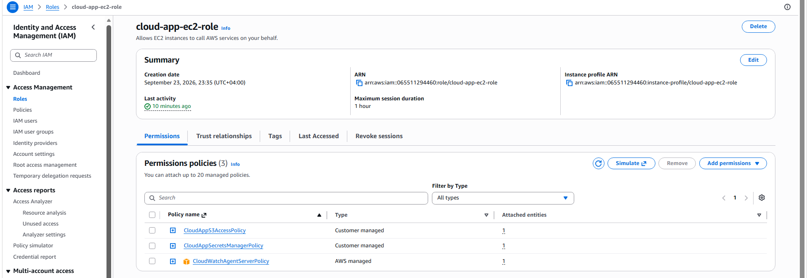
[IAM]

---

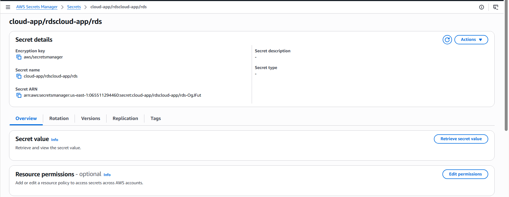
[Secrets Manager]

---

## Monitoring

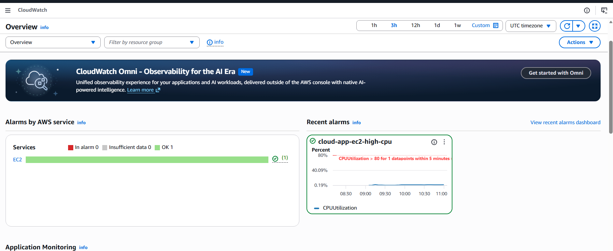
[CloudWatch Metrics]

---

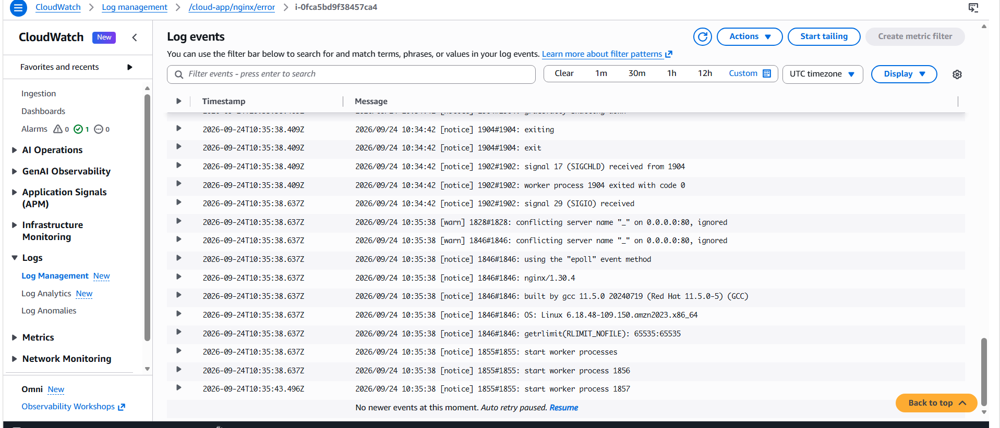
[CloudWatch Logs]

---

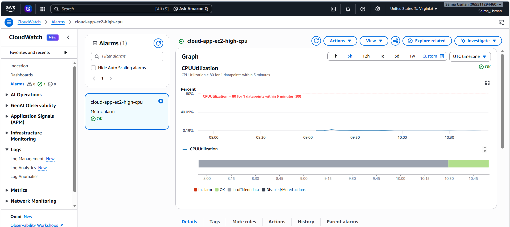
![CloudWatch Alarm]

---

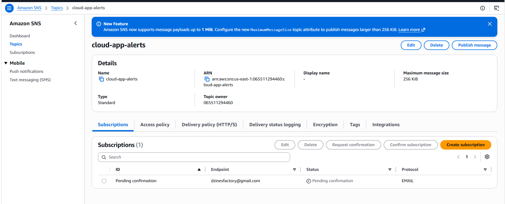
[SNS]

---